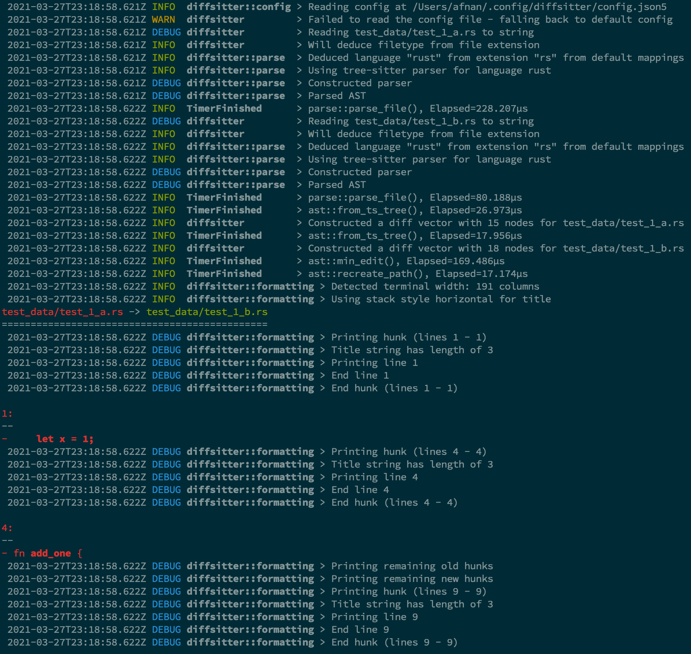

# diffsitter

[](https://github.com/afnanenayet/diffsitter/actions/workflows/CI.yml)
[](https://github.com/afnanenayet/diffsitter/actions/workflows/CD.yml)
[](https://codecov.io/gh/afnanenayet/diffsitter)
[](https://crates.io/crates/diffsitter)
[](https://github.com/afnanenayet/diffsitter/releases/latest)

[](./LICENSE)

[](https://asciinema.org/a/joEIfP8XoxUhZKXEqUD8CEP7j)

## Disclaimer

`diffsitter` is very much a work in progress and nowhere close to production
ready (yet). Contributions are always welcome!

## Summary

`diffsitter` creates semantically meaningful diffs that ignore formatting
differences like spacing. It does so by computing a diff on the AST (abstract
syntax tree) of a file rather than computing the diff on the text contents of
the file.

`diffsitter` uses the parsers from the
[tree-sitter](https://tree-sitter.github.io/tree-sitter) project to parse
source code. As such, the languages supported by this tool are restricted to the
languages supported by tree-sitter.

`diffsitter` supports the following languages:

* Bash
* C#
* C++
* CSS
* Go
* Java
* OCaml
* PHP
* Python
* Ruby
* Rust
* Typescript/TSX
* HCL

## Examples

Take the following files:

[`a.rs`](test_data/short/rust/a.rs)

```rust
fn main() {
    let x = 1;
}

fn add_one {
}
```

[`b.rs`](test_data/short/rust/b.rs)

```rust
fn


main

()

{
}

fn addition() {
}

fn add_two() {
}
```

The standard output from `diff` will get you:

```text
1,2c1,12
< fn main() {
<     let x = 1;
---
> fn
>
>
>
> main
>
> ()
>
> {
> }
>
> fn addition() {
5c15
< fn add_one {
---
> fn add_two() {
```

You can see that it picks up the formatting differences for the `main`
function, even though they aren't semantically different.

Check out the output from `diffsitter`:

```
test_data/short/rust/a.rs -> test_data/short/rust/b.rs
======================================================

9:
--
+ }

11:
---
+ fn addition() {

1:
--
-     let x = 1;

14:
---
+ fn add_two() {

4:
--
- fn add_one {
```

*Note: the numbers correspond to line numbers from the original files.*

You can also filter which tree sitter nodes are considered in the diff through
the config file.

Since it uses the AST to calculate the difference, it knows that the formatting
differences in `main` between the two files isn't a meaningful difference, so
it doesn't show up in the diff.

`diffsitter` has some nice (terminal aware) formatting too:


It also has extensive logging if you want to debug or see timing information:



### Node filtering

You can filter the nodes that are considered in the diff by setting
`include_nodes` or `exclude_nodes` in the config file. `exclude_nodes` always
takes precedence over `include_nodes`, and the type of a node is the `kind`
of a tree-sitter node.

This feature currently only applies to leaf nodes, but we could exclude nodes
recursively if there's demand for it.

```json5
"input-processing": {
    // You can exclude different tree sitter node types - this rule takes precedence over `include_kinds`.
    "exclude_kinds": ["string"],
    // You can specifically allow only certain tree sitter node types
    "include_kinds": ["method_definition"],
}
```

## Installation

<a href="https://repology.org/project/diffsitter/versions">
  
</a>

### Published binaries

This project uses Github actions to build and publish binaries for each tagged
release. You can download binaries from there if your platform is listed. We
publish [nightly releases](https://github.com/afnanenayet/diffsitter/releases/tag/nightly)
as well as tagged [stable releases](https://github.com/afnanenayet/diffsitter/releases/latest).

### Cargo

You can build from source with `cargo` using the following command:

```sh
cargo install diffsitter --bin diffsitter
```

If you want to generate completion files and other assets you can install the
`diffsitter_completions` binary with the following command:

```sh
cargo install diffsitter --bin diffsitter_completions
```

### Homebrew

You can use my tap to install diffsitter:

```sh
brew tap afnanenayet/tap
brew install diffsitter
# brew install afnanenayet/tap/diffsitter
```

### Arch Linux (AUR)

@samhh has packaged diffsitter for arch on the AUR. Use your favorite AUR
helper to install [`diffsitter-bin`](https://aur.archlinux.org/packages/diffsitter-bin/).

### Alpine Linux

Install package [diffsitter](https://pkgs.alpinelinux.org/packages?name=diffsitter) from the Alpine Linux repositories (on v3.16+ or Edge):

```sh
apk add diffsitter
```

Tree-sitter grammars are packaged separately (search for [tree-sitter-\*](https://pkgs.alpinelinux.org/packages?name=tree-sitter-*&arch=x86_64)).
You can install individual packages you need or the virtual package `tree-sitter-grammars` to install all of them.

### Building with Docker

We also provide a Docker image that builds diffsitter using the standard Rust
base image. It separates the compilation stage from the run stage, so you can
build it and run with the following command (assuming you have Docker installed
on your system):

```sh
docker build -t diffsitter .
docker run -it --rm --name diffsitter-interactive diffsitter
```

## Usage

For detailed help you can run `diffsitter --help` (`diffsitter -h` provides
brief help messages).

You can configure file associations and formatting options for `diffsitter`
using a config file. If a config is not supplied, the app will use the default
config, which you can see with `diffsitter --cmd dump_default_config`. It will
look for a config at `${XDG_HOME:-$HOME}/.config/diffsitter/config.json5` on
macOS and Linux, and the standard directory for Windows. You can also refer to
the [sample config](/assets/sample_config.json5).

You can override the default config path by using the `--config` flag or set
the `DIFFSITTER_CONFIG` environment variable.

*Note: the tests for this crate check to make sure the provided sample config
is a valid config.*

### Git integration

To see the changes to the current git repo in diffsitter, you can add
the following to your repo's `.git/config` and run `git difftool`.

```
[diff]
        tool = diffsitter

[difftool]
        prompt = false

[difftool "diffsitter"]
        cmd = diffsitter "$LOCAL" "$REMOTE"
```

### Shell Completion

You can generate shell completion scripts using the binary using the
`gen-completion` subcommand. This will print the shell completion script for a
given shell to `STDOUT`.

You should use the help text for the most up to date usage information, but
general usage would look like this:

```sh
diffsitter gen-completion bash > completion.bash
```

We currently support the following shells (via `clap_complete`):

* Bash
* Zsh
* Fish
* Elvish
* Powershell

## Dependencies

`diffsitter` is usually compiled as a static binary, so the `tree-sitter`
grammars/libraries are baked into the binary as static libraries. There is an
option to build with support for dynamic libraries which will look for shared
library files in the user's default library path. This will search for
library files of the form `libtree-sitter-{lang}.{ext}`, where `lang` is the
language that the user is trying to diff and `ext` is the platform-specific
extension for shared library files (`.so`, `.dylib`, etc). The user can
override the dynamic library file for each language in the config as such:

```json5
{
    "grammar": {
        // You can specify the dynamic library names for each language
        "dylib-overrides": {
            // with a filename
            "rust": "libtree-sitter-rust.so",
            // with an absolute path
            "c": "/usr/lib/libtree-sitter-c.so",
            // with a relative path
            "cpp": "../libtree-sitter-c.so",
        },
    }
}
```

*The above excerpt was taken from the
[sample config](/assets/sample_config.json5).*

## Questions, Bugs, and Support

If you notice any bugs, have any issues, want to see a new feature, or just
have a question, feel free to open an
[issue](https://github.com/afnanenayet/diffsitter/issues) or create a
[discussion post](https://github.com/afnanenayet/diffsitter/discussions).

If you file an issue, it would be preferable that you include a minimal example
and/or post the log output of `diffsitter` (which you can do by adding the
`-d/--debug` flag).

## Contributing

See [CONTRIBUTING.md](docs/CONTRIBUTING.md).

## Similar Projects

* [difftastic](https://github.com/Wilfred/difftastic)
* [locust](https://github.com/bugout-dev/locust)
* [gumtree](https://github.com/GumTreeDiff/gumtree)
* [diffr](https://github.com/mookid/diffr)
* [delta](https://github.com/dandavison/delta)
* [Semantic Diff Tool](https://www.sdt.dev)
