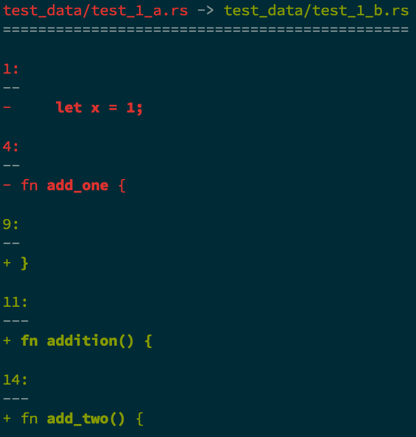

# diffsitter


[](https://asciinema.org/a/383291)

## Summary

`diffsitter` performs diffs on text files using the AST to compute the diff
instead of using a naive text-based diff. This can give you more semantically
meaningful diff information, which will prevent diffs from getting polluted by
formatting differences, for example.

`diffstter` uses the parsers from the
[tree-sitter](https://tree-sitter.github.io/tree-sitter/) project to parse
source code. As such, the languages supported by this tool are limited by the
languages supported by the tree-sitter project.

## Examples

Take the following files:

`a.rs`:

```rust
fn main() {
    let x = 1;
}
```

`b.rs`

```rust
fn


main

()

{
}

fn addition() {
}

fn add_two() {
}
```

The standard output from `diff` will get you:

```text
1,2c1,12
< fn main() {
<     let x = 1;
---
> fn
>
>
>
> main
>
> ()
>
> {
> }
>
> fn addition() {
5c15
< fn add_one {
---
> fn add_two() {
```

You can see that it picks up the formatting differences for the `main`
function, even though they aren't semantically different.

Check out the output from `diffsitter`:

```text
-     let x = 1;
- fn add_one {
+ }
+ fn addition() {
+ fn add_two() {
```

Since it uses the AST to calculate the difference, it knows that the formatting
differences in `main` between the two files isn't a meaningful difference, so
it doesn't show up in the diff.

`diffsitter` has some nice (terminal aware) formatting too:



## Installation

### Published binaries

This project uses Github actions to build and publish binaries for each tagged
release. You can download binaries from there if your platform is listed.

### Cargo

You can install using `cargo` the standard way with `cargo install diffsitter`.

### Homebrew

You can use my tap to install diffsitter:

```sh
brew tap afnanenayet/tap
brew install diffsitter
# brew install afnanenayet/tap/diffsitter
```

## Development

In order to develop for this project, you need to clone the project and
initialize all submodules (each tree-sitter grammar is added as a
subdirectory).

```sh
git clone
git submodule --init --recursive
```

This uses `cargo` with the `cc` crate, so you need to install rust and have a
working C and C++ compiler.

This project targets the latest stable version of rustc, it may work on older
versions, but I only guarantee support for the latest stable release.
