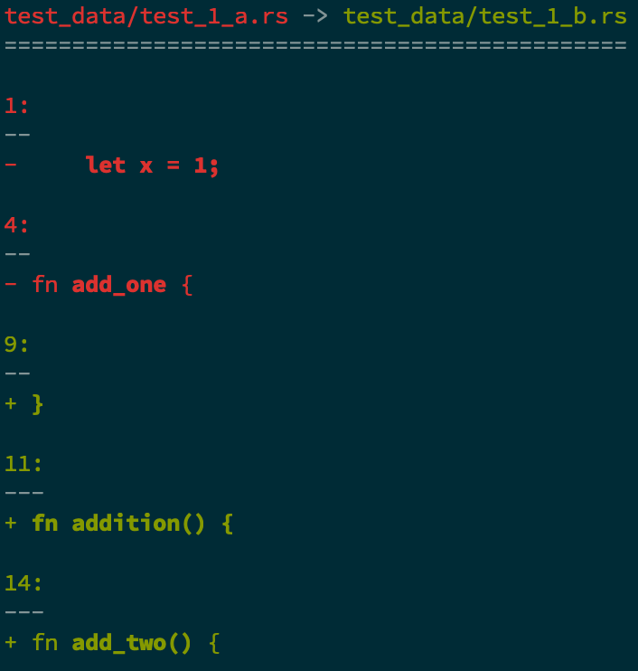
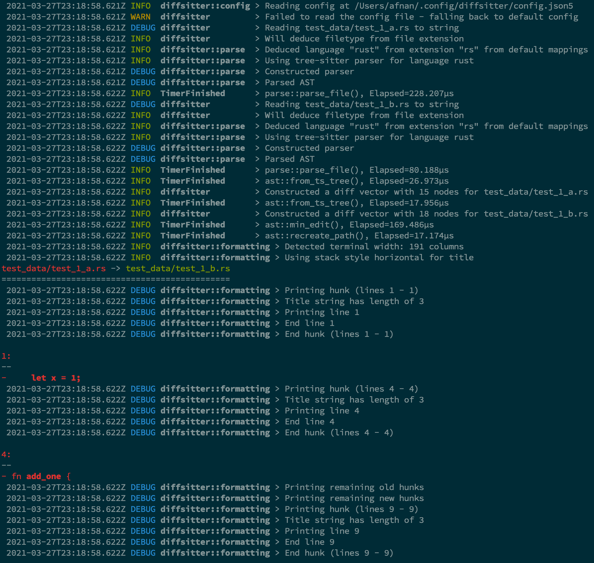

# diffsitter

[](https://github.com/afnanenayet/diffsitter/actions/workflows/CI.yml)
[](https://github.com/afnanenayet/diffsitter/actions/workflows/CD.yml)
[](https://codecov.io/gh/afnanenayet/diffsitter)
[](https://crates.io/crates/diffsitter)
[](https://github.com/afnanenayet/diffsitter/releases/latest)

[](./LICENSE)

[](https://asciinema.org/a/joEIfP8XoxUhZKXEqUD8CEP7j)

## Disclaimer

`diffsitter` is very much a work in progress and nowhere close to production
ready (yet). Contributions are always welcome!

## Summary

`diffsitter` creates semantically meaningful diffs that ignore formatting
differences like spacing. It does so by computing a diff on the AST (abstract
syntax tree) of a file rather than computing the diff on the text contents of
the file.

`diffsitter` uses the parsers from the
[tree-sitter](https://tree-sitter.github.io/tree-sitter) project to parse
source code. As such, the languages supported by this tool are restricted to the
languages supported by tree-sitter.

`diffsitter` supports the following languages:

* Bash
* C#
* C++
* CSS
* Go
* Java
* OCaml
* PHP
* Python
* Ruby
* Rust
* Typescript/TSX
* HCL

## Examples

Take the following files:

[`a.rs`](test_data/short/rust/a.rs)

```rust
fn main() {
    let x = 1;
}

fn add_one {
}
```

[`b.rs`](test_data/short/rust/b.rs)

```rust
fn


main

()

{
}

fn addition() {
}

fn add_two() {
}
```

The standard output from `diff` will get you:

```text
1,2c1,12
< fn main() {
<     let x = 1;
---
> fn
>
>
>
> main
>
> ()
>
> {
> }
>
> fn addition() {
5c15
< fn add_one {
---
> fn add_two() {
```

You can see that it picks up the formatting differences for the `main`
function, even though they aren't semantically different.

Check out the output from `diffsitter`:

```
test_data/short/rust/a.rs -> test_data/short/rust/b.rs
======================================================

9:
--
+ }

11:
---
+ fn addition() {

1:
--
-     let x = 1;

14:
---
+ fn add_two() {

4:
--
- fn add_one {
```

*Note: the numbers correspond to line numbers from the original files.*

You can also filter which tree sitter nodes are considered in the diff through
the config file.

Since it uses the AST to calculate the difference, it knows that the formatting
differences in `main` between the two files isn't a meaningful difference, so
it doesn't show up in the diff.

`diffsitter` has some nice (terminal aware) formatting too:



It also has extensive logging if you want to debug or see timing information:



### Node filtering

You can filter the nodes that are considered in the diff by setting
`include_nodes` or `exclude_nodes` in the config file. `exclude_nodes` always
takes precedence over `include_nodes`, and the type of a node is the `kind`
of a tree-sitter node. The `kind` directly corresponds to whatever is reported
by the tree-sitter API, so this example may occasionally go out of date.

This feature currently only applies to leaf nodes, but we could exclude nodes
recursively if there's demand for it.

```json5
"input-processing": {
    // You can exclude different tree sitter node types - this rule takes precedence over `include_kinds`.
    "exclude_kinds": ["string_content"],
    // You can specifically allow only certain tree sitter node types
    "include_kinds": ["method_definition"],
}
```

## Installation

<a href="https://repology.org/project/diffsitter/versions">
  
</a>

### Published binaries

This project uses Github actions to build and publish binaries for each tagged
release. You can download binaries from there if your platform is listed. We
publish [nightly releases](https://github.com/afnanenayet/diffsitter/releases/tag/nightly)
as well as tagged [stable releases](https://github.com/afnanenayet/diffsitter/releases/latest).

### Cargo

You can build from source with `cargo` using the following command:

```sh
cargo install diffsitter --bin diffsitter
```

If you want to generate completion files and other assets you can install the
`diffsitter_completions` binary with the following command:

```sh
cargo install diffsitter --bin diffsitter_completions
```

### Homebrew

You can use my tap to install diffsitter:

```sh
brew tap afnanenayet/tap
brew install diffsitter
# brew install afnanenayet/tap/diffsitter
```

### Arch Linux (AUR)

@samhh has packaged diffsitter for arch on the AUR. Use your favorite AUR
helper to install [`diffsitter-bin`](https://aur.archlinux.org/packages/diffsitter-bin/).

### Alpine Linux

Install package [diffsitter](https://pkgs.alpinelinux.org/packages?name=diffsitter) from the Alpine Linux repositories (on v3.16+ or Edge):

```sh
apk add diffsitter
```

Tree-sitter grammars are packaged separately (search for [tree-sitter-\*](https://pkgs.alpinelinux.org/packages?name=tree-sitter-*&arch=x86_64)).
You can install individual packages you need or the virtual package `tree-sitter-grammars` to install all of them.

### Building with Docker

We also provide a Docker image that builds diffsitter using the standard Rust
base image. It separates the compilation stage from the run stage, so you can
build it and run with the following command (assuming you have Docker installed
on your system):

```sh
docker build -t diffsitter .
docker run -it --rm --name diffsitter-interactive diffsitter
```

## Usage

For detailed help you can run `diffsitter --help` (`diffsitter -h` provides
brief help messages).

You can configure file associations and formatting options for `diffsitter`
using a config file. If a config is not supplied, the app will use the default
config, which you can see with `diffsitter dump-default-config`. It will
look for a config at `${XDG_HOME:-$HOME}/.config/diffsitter/config.json5` on
macOS and Linux, and the standard directory for Windows. You can also refer to
the [sample config](/assets/sample_config.json5).

You can override the default config path by using the `--config` flag or set
the `DIFFSITTER_CONFIG` environment variable.

*Note: the tests for this crate check to make sure the provided sample config
is a valid config.*

### Git integration

To see the changes to the current git repo in diffsitter, you can add
the following to your repo's `.git/config` and run `git difftool`.

```
[diff]
        tool = diffsitter

[difftool]
        prompt = false

[difftool "diffsitter"]
        cmd = diffsitter "$LOCAL" "$REMOTE"
```

### Shell Completion

You can generate shell completion scripts using the binary using the
`gen-completion` subcommand. This will print the shell completion script for a
given shell to `STDOUT`.

You should use the help text for the most up to date usage information, but
general usage would look like this:

```sh
diffsitter gen-completion bash > completion.bash
```

We currently support the following shells (via `clap_complete`):

* Bash
* Zsh
* Fish
* Elvish
* Powershell

## Dependencies

`diffsitter` is usually compiled as a static binary, so the `tree-sitter`
grammars/libraries are baked into the binary as static libraries. There is an
option to build with support for dynamic libraries which will look for shared
library files in the user's default library path. This will search for
library files of the form `libtree-sitter-{lang}.{ext}`, where `lang` is the
language that the user is trying to diff and `ext` is the platform-specific
extension for shared library files (`.so`, `.dylib`, etc). The user can
override the dynamic library file for each language in the config as such:

```json5
{
    "grammar": {
        // You can specify the dynamic library names for each language
        "dylib-overrides": {
            // with a filename
            "rust": "libtree-sitter-rust.so",
            // with an absolute path
            "c": "/usr/lib/libtree-sitter-c.so",
            // with a relative path
            "cpp": "../libtree-sitter-c.so",
        },
    }
}
```

*The above excerpt was taken from the
[sample config](/assets/sample_config.json5).*

## MCP Server (AI Code Navigation)

diffsitter includes an [MCP](https://modelcontextprotocol.io) server that
exposes tree-sitter AST navigation as tools for AI coding assistants. This
gives tools like [Claude Code](https://claude.ai/code) structural
understanding of your code — jumping to definitions by name, listing symbols,
inspecting scopes, and running tree-sitter queries — across all 14+ supported
languages.

### Tools

| Tool | Description |
|------|-------------|
| `parse_file` | Parse a file and return its top-level AST structure |
| `list_symbols` | List all functions, classes, structs, traits, enums, constants |
| `get_definition` | Get the full source text of a symbol by name |
| `get_children_of` | Get methods/fields inside a class, impl block, or module |
| `get_node_at_position` | Get the deepest AST node at a line/column |
| `get_scope` | Get the enclosing scope at a position with full parent chain |
| `navigate` | Move through the AST: parent, first_child, next_sibling, prev_sibling |
| `query` | Run a raw tree-sitter S-expression query with captures |

### Setup

Build the MCP server binary:

```sh
cargo build --release --features mcp-server --bin tree-sitter-mcp
```

Or install from crates.io:

```sh
cargo install diffsitter --features mcp-server --bin tree-sitter-mcp
```

#### Claude Code

Register the server with Claude Code:

```sh
# Register the binary as an MCP server
claude mcp add tree-sitter-mcp -- /path/to/tree-sitter-mcp

# Or use the bundled plugin for development (loads for one session)
claude --plugin-dir ./plugins/tree-sitter-mcp
```

Once registered, Claude Code can use the tools automatically. For example,
asking "what functions are defined in src/diff.rs?" will use `list_symbols`
instead of reading the entire file.

#### Other MCP clients

The server communicates over stdio using
[JSON-RPC](https://www.jsonrpc.org/specification). Any MCP-compatible client
can use it by launching the binary as a subprocess:

```json
{
  "mcpServers": {
    "tree-sitter-mcp": {
      "command": "/path/to/tree-sitter-mcp"
    }
  }
}
```

### Example queries

The MCP server understands language grammar, not just text. Where `grep` finds
string patterns, tree-sitter-mcp finds *syntactic* patterns — it knows the
difference between a function called `test` and a `#[test]` attribute.

#### Symbol discovery

```
# "What's defined in this file?"
list_symbols  →  file_path: "src/diff.rs"

# "What methods does the Renderer trait define?"
get_children_of  →  file_path: "src/render/mod.rs", symbol_name: "Renderer"

# "Show me the signature of generate_ast_vector_data without reading the whole file"
get_definition  →  file_path: "src/lib.rs", symbol_name: "generate_ast_vector_data"
```

#### Scope & context

```
# "What function contains line 145 of src/diff.rs? Show me the full parent chain."
get_scope  →  file_path: "src/diff.rs", line: 145, column: 0

# "What's the AST node at this position? Navigate to its parent, then next sibling."
get_node_at_position  →  file_path: "src/lib.rs", line: 50, column: 10
navigate  →  file_path: "src/lib.rs", line: 50, column: 10, direction: "parent"
```

#### Tree-sitter queries (the real power)

The `query` tool accepts [tree-sitter S-expression
patterns](https://tree-sitter.github.io/tree-sitter/using-parsers/queries/index.html)
for structural code search:

```
# Find all unsafe blocks
query  →  file_path: "src/diff.rs"
          pattern: "(unsafe_block) @unsafe"

# Find all impl blocks for a specific type
query  →  file_path: "src/config.rs"
          pattern: '(impl_item type: (type_identifier) @name (#eq? @name "Config")) @impl'

# Find all functions that return a Result
query  →  file_path: "src/diff.rs"
          pattern: '(function_item
            name: (identifier) @name
            return_type: (generic_type
              type: (type_identifier) @ret (#eq? @ret "Result"))) @fn'

# Find all #[test] functions
query  →  file_path: "src/diff.rs"
          pattern: '(attribute_item (attribute (identifier) @attr (#eq? @attr "test"))) @test'

# Find all closures
query  →  file_path: "src/input_processing.rs"
          pattern: "(closure_expression) @closure"
```

## Questions, Bugs, and Support

If you notice any bugs, have any issues, want to see a new feature, or just
have a question, feel free to open an
[issue](https://github.com/afnanenayet/diffsitter/issues) or create a
[discussion post](https://github.com/afnanenayet/diffsitter/discussions).

If you file an issue, it would be preferable that you include a minimal example
and/or post the log output of `diffsitter` (which you can do by adding the
`-d/--debug` flag).

## Development

### Prerequisites

- **Rust toolchain** (MSRV 1.85.1, edition 2024) — install via [rustup](https://rustup.rs/)
- **C99+ compiler** and **C++14+ compiler** — required to compile tree-sitter grammars (Apple Clang, GCC, or LLVM all work)
- **Git submodules** initialized — the build compiles tree-sitter grammars from vendored sources in `grammars/`

```sh
# Clone with submodules
git clone --recurse-submodules https://github.com/afnanenayet/diffsitter.git

# Or initialize submodules in an existing checkout
git submodule update --init --recursive
```

#### Recommended tools

These are not required for building diffsitter itself, but are used for development and CI:

| Tool | Install | Purpose |
|------|---------|---------|
| [cargo-nextest](https://nexte.st) | `cargo install cargo-nextest` | Test runner (used in CI, configured in `.config/nextest.toml`) |
| [cargo-insta](https://insta.rs) | `cargo install cargo-insta` | Snapshot test review TUI |
| [pre-commit](https://pre-commit.com) | `pip install pre-commit` | Git hook manager for formatting/linting |
| [cargo-fuzz](https://github.com/rust-fuzz/cargo-fuzz) | `cargo install cargo-fuzz` | Fuzz testing (requires nightly Rust) |

### Building

```sh
cargo build                                                            # Default: static grammars
cargo build --no-default-features --features dynamic-grammar-libs      # Dynamic grammar loading
cargo build --profile production                                       # Release build with LTO + strip
cargo build --features mcp-server --bin tree-sitter-mcp                # MCP server binary
```

The default build compiles all tree-sitter grammars from C/C++ source into the binary. Use `cargo check` for a fast feedback loop that skips grammar compilation.

### Testing

```sh
cargo nextest run --all-features                  # All tests (preferred)
cargo test --all-features                         # Fallback without nextest
cargo test --doc --all-features                   # Doc tests only (nextest doesn't run these)
cargo insta review                                # Review/accept changed snapshots
```

### Linting

```sh
cargo fmt --all -- --check                        # Check formatting
cargo fmt --all                                   # Auto-format
cargo clippy --all-targets --all-features -- -D warnings   # Lint (matches CI)
```

### Benchmarks

```sh
cargo bench                                       # Run all criterion benchmarks
cargo bench -- <filter>                           # Run benchmarks matching filter
```

Benchmarks use [criterion](https://github.com/bheisler/criterion.rs) and cover parsing, cache performance, symbol listing, navigation, and query execution. Results are written to `target/criterion/`.

### Fuzz testing

```sh
cargo +nightly fuzz list                          # List available fuzz targets
cargo +nightly fuzz run fuzz_parse_and_navigate -- -max_total_time=60
cargo +nightly fuzz run fuzz_query -- -max_total_time=60
cargo +nightly fuzz run fuzz_node_to_info -- -max_total_time=60
```

### Feature flags

| Flag | Default | Description |
|------|---------|-------------|
| `static-grammar-libs` | Yes | Compiles tree-sitter grammars into the binary |
| `dynamic-grammar-libs` | No | Loads grammars from system shared libraries at runtime |
| `better-build-info` | No | Extended build metadata via shadow-rs |
| `mcp-server` | No | Builds `tree-sitter-mcp` binary (adds `rmcp`, `tokio`, `schemars`) |

## Contributing

See [CONTRIBUTING.md](docs/CONTRIBUTING.md).

## Similar Projects

* [difftastic](https://github.com/Wilfred/difftastic)
* [locust](https://github.com/bugout-dev/locust)
* [gumtree](https://github.com/GumTreeDiff/gumtree)
* [diffr](https://github.com/mookid/diffr)
* [delta](https://github.com/dandavison/delta)
* [Semantic Diff Tool](https://www.sdt.dev)
* [sem](https://github.com/ataraxy-labs/sem)
